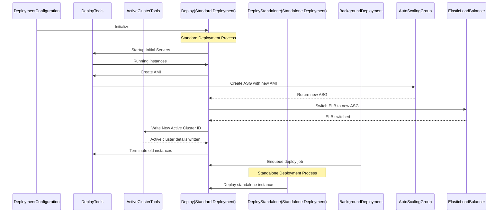
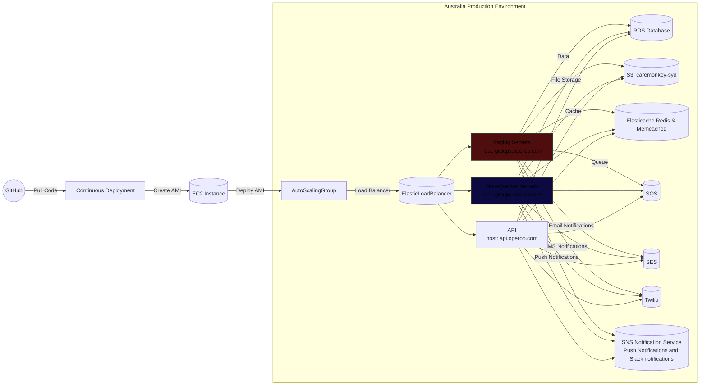

# Mermaid diagrams

Mermaid is a simple markdown-like script language for generating charts from text via javascript. It works in the VSCode preview pane, and can be exported to SVG or PNG.

## Operoo Deployment

The following diagram shows the steps involved in deploying the Operoo application.

The following diagram shows the deployment of the Operoo application to the Australian production environment.

