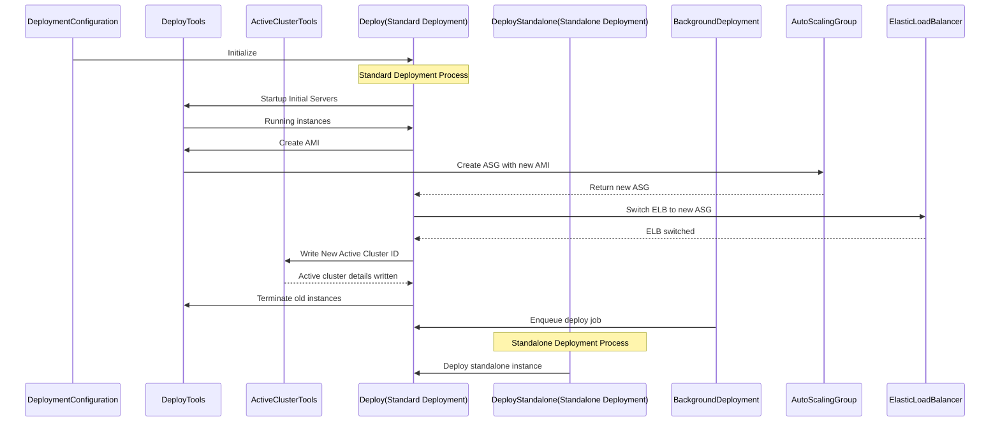
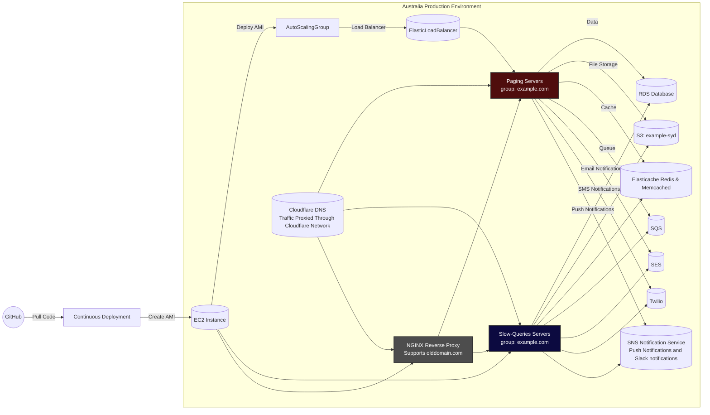

# Ruby on Rails full CI/CD

This is a drill to practice the full CI/CD process for a Ruby on Rails application.

## Deployment Process

This is an integral part of the application's deployment system, designed to manage AWS EC2 instances and automate the process of deploying new versions of the app. The application is a Ruby on Rails web application hosted on AWS infrastructure, utilizing EC2 instances, Auto Scaling Groups (ASGs), Elastic Load Balancers (ELBs), RDS databases, S3 for file storage, and Redis for caching and background jobs.

**Key Classes**

* **DeploymentConfiguration**: Represents the configuration for a specific deployment environment (e.g., staging or production). It loads settings like VPC id, instance types from a constant CONFIGURATION\_DATA, and can parse a hash to initialize the configuration.
* **DeployTools**: Provides tools to assist with deployments and scaling. It can get lists of running instances, calculate instance counts needed, and generate EC2 host names for instances.
* **ActiveClusterTools**: Manages the "active cluster" details stored as tags on the ELB. It can read and write the active cluster id, branch, etc.
* **Deploy**: Orchestrates a full deployment process, handling everything from starting initial instances to creating an Auto Scaling Group with a new AMI, switching the ELB to the new ASG, and terminating old instances.
* **DeployStandalone**: Similar to Deploy, but designed for deploying a standalone  instance.
* **BackgroundDeployment**: Enqueues a deployment to be run in the background by Resque.

**Key Utility Classes**

* **CreateAmi**: Creates an AMI from an EC2 instance.
* **InstanceManagerService**: Manages start, stop, and terminate operations for instances.
* **InstanceStats**: Retrieves CPU utilization for instances.
* **TestCluster**: Tests connectivity to cluster instances.
* **ElbTools**: Manages ELB and target groups.
* **WaitForHealthyTrafficOnAsg**: Waits for ASG instances to become healthy.

**Resque Job Classes**

* **BackgroundDeployment**: Deploys in the background.
* **BackgroundStandaloneDeployment**: Deploys standalone in the background.

**Main Deployment Process**

1. **Start initial instances**: A "slowqueries" instance for running background workers and a "pageserver" instance for building the app are initiated.
2. **Create AMI from pageserver**: The pageserver executes deploy steps like bundling gems, precompiling assets, and then creates an AMI. This AMI contains the fully built new version of the app.
3. **Create AutoScaling Group**: An ASG is created using the new AMI, set to launch instances to run the new app version.
4. **Create ELB listener**: A listener is added to the ELB, configured to route traffic to the new ASG.
5. **Wait for healthy instances**: The system waits for the ASG to launch instances and for them to pass ELB health checks.
6. **Set new cluster as active**: The ELB tags are updated to mark the new set of servers as the active cluster.
7. **Terminate old instances**: Once the deployment is complete, the old servers are terminated.

This approach ensures a fully built and tested app on the initial pageserver instance, a smooth launch of fully prepared servers using the new AMI by the ASG, and a zero downtime deployment with the ELB routing traffic seamlessly.

## Deployment

The following diagram shows the steps involved in deploying the application.

The following diagram shows the deployment of the application to the Australian production environment.

